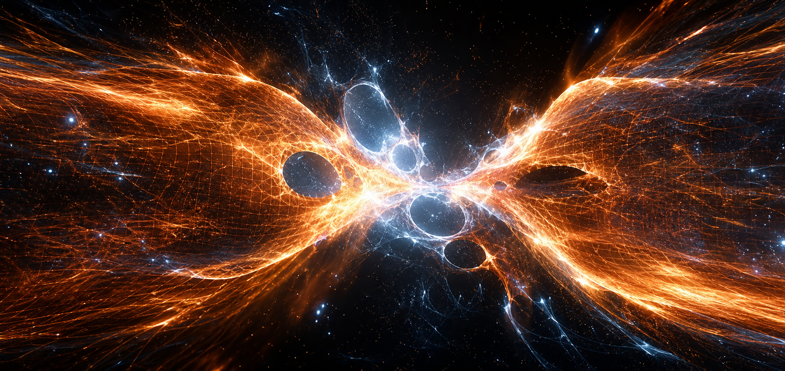
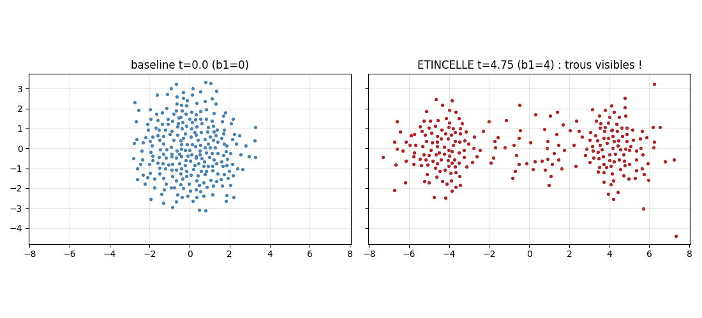
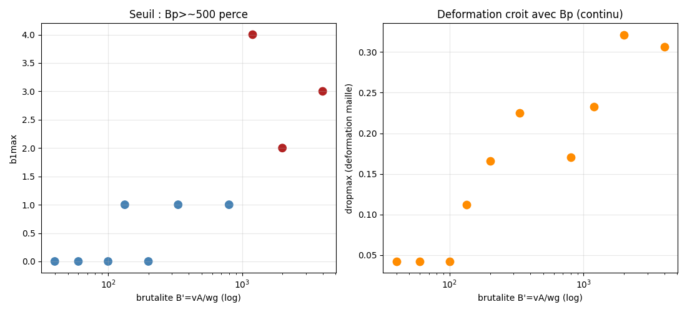
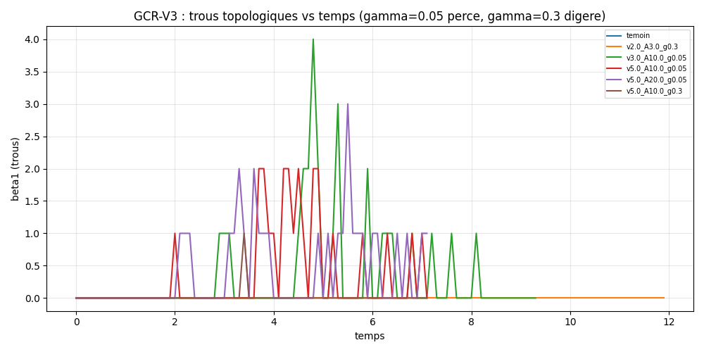
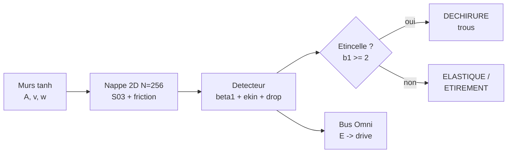

<p align="center"></p>

<h1 align="center">GCR — Grand Collisionneur de Ratiss</h1>
<p align="center"><i>Collision de 2 murs tanh dans une nappe auto-gravitante — les <b>étincelles topologiques</b>, mesurées.</i></p>
<p align="center"><b>Univers virtuel uniquement</b> — SANS NEURONES, 100% tissu. ⚡</p>

<p align="center">


</p>

<p align="center"></p>

> *« Le tissu ne se contente pas de vibrer : à B'≳500, il se perce — puis ne se referme jamais. »*
> — le chef. (V1 a explosé en vol. On l'a invalidée, pas patchée. 😇)

---

## ⚡ En 30 secondes

| ⚡ | Découverte | Verdict mesuré (batterie V3, 11 runs) |
|---|---|---|
| 1 | Étincelle topologique | trous **b1=2-4**, vie 0.2-0.8tu, si γ=0.05, A≥10, v≥3 |
| 2 | Déchirure vs étirement | γ bas : trous · γ haut : drop 0.23, **jamais** de trou |
| 3 | Seuil élastique | A=3 : b1=0, le tissu **survit** |
| 4 | Fragmentation irréversible | r_rms 2→13, ouvert, pas de re-cuisson |
| 5 | V1 invalidée | explosion numérique → réfutée ; V3 : **0 clips** |

**Statut : V3 STABLE, 4/4 TESTS.** Détails : [DECOUVERTES.md](DECOUVERTES.md).

---

## 🗺️ Sommaire

1. [Le concept](#concept) — 2. [Démarrage rapide](#quickstart) — 3. [Les salles du labo](#salles) — 4. [La batterie](#batterie) — 5. [Chiffres-clés](#chiffres) — 6. [Exemples](#exemples) — 7. [La méthode](#methode) — 8. [Architecture](#archi) — 9. [Roadmap](#roadmap) — 10. [Arborescence](#arbo) — 11. [Crédits](#credits)

---

<a id="concept"></a>
## 1. 💡 Le concept

**Le constat** : que se passe-t-il quand deux murs d'énergie percutent une nappe de matière auto-gravitante dont le tissu a une **raideur de Planck** (micro-loi S03 : F=-g/r²+k/r⁴, k=0.108) ? Ici : N=256 particules 2D, murs cinématiques gaussiens, détecteur β1 exact (caractéristique d'Euler sur complexe alpha). On mesure la **brutalité** B'=v·A/(w·γ) et on regarde si le tissu vibre, s'étire — ou **se déchire en trous topologiques**.

**Unités jouet** : capacité à déformer, PAS de GeV. Le QPU (testeur hardware) vit dans synchrotron-24/qpu-bigbang — GCR = virtuel pur.

---

<a id="quickstart"></a>
## 2. 🚀 Démarrage rapide

```bash
git clone https://github.com/jonathansearch/GCR.git
cd GCR
pip install -e .
pytest tests/ -q                    # 4/4 (témoin, étincelle, étirement, Omni)
python3 univers/batterie_gcr.py     # 11 runs, 69 s -> resultats/gcr_v1.json
```

---

<a id="salles"></a>
## 3. 🏛️ Les salles du labo

| Salle | Dossier | Contenu |
|---|---|---|
| ⚡ Collisionneur | `univers/` | collision.py (moteur) + batterie_gcr.py (11 runs) |
| 📦 Faits bruts | `resultats/` | gcr_v1.json (les nombres) |
| 🎫 Question | `tickets/` | ETINCELLE_TOPOLOGIQUE.md |
| 📜 Journal | `JOURNAL.md` | le bord complet |
| ⚡ Trouvailles | `DECOUVERTES.md` | les 6 découvertes scellées |
| 🖼️ Galerie | `figures/` + `images/` | 3 figures + logo + fresque |

---

<a id="batterie"></a>
## 4. 🧪 La batterie V3 (11 runs, 0 clips)

| v | A | γ | b1max | drop | E_max/E_eq | verdict |
|---|---|---|---|---|---|---|
| 2-5 | 3 | 0.3 | 0 | 0.04 | ~1.0 | élastique 🎈 |
| 2-5 | 10 | 0.3 | 0-1 | ≤0.23 | ≤7.8 | étirement (jamais de trou !) |
| 3 | 10 | **0.05** | **4** | 0.23 | 3.6 | **ÉTINCELLE** ⚡ |
| 5 | 10 | **0.05** | **2** | 0.32 | 4.8 | **ÉTINCELLE** ⚡ |
| 5 | 20 | **0.05** | **3** | 0.31 | 10.0 | **ÉTINCELLE** ⚡ |

Témoin (A=0) : b1max=0. Seuil : B'≳500 + γ bas. vmax saines partout.





---

<a id="chiffres"></a>
## 5. 📊 Chiffres-clés

| Mesure | Valeur | Témoin |
|---|---|---|
| Étincelles | b1 = 2, 3, 4 (3 runs) | A=0 : b1=0 |
| Seuil | γ=0.05, A≥10, v≥3 (B'≳500) | γ=0.3 : 0 trou même à E×7.8 |
| Drop max (étirement) | 0.23 | — |
| Stabilité | 0 clips, vmax ≤ 9.6 | V1 : e_kin~1e6 (invalidée) |
| Destin | r_rms 2→13, irréversible | — |

---

<a id="exemples"></a>
## 6. 💻 Exemples

**Ex. 1 — Un tir qui fait étincelle :**
```python
import sys; sys.path.insert(0, 'univers')
from collision import run, etincelle
s, eq, _ = run(5.0, 0.5, A=10.0, gamma=0.05)
print(etincelle(s))   # b1_max=2.0, etincelle=True
```

**Ex. 2 — GCR pilote Omni (mise à jour écosystème) :**
```python
from ratiss_core.bus import OmniBus
from ratiss_core.control import control_step
bus = OmniBus('/tmp/gcr_bus.dat', create=True)
bus.write(E_turb=max(p['ekin'] for p in s), T2_us=223.7, Q_fus=2.0)
print(control_step(bus))   # drive ajusté depuis la collision
```

---

<a id="methode"></a>
## 7. ⚖️ La méthode

**Équilibrer avant de tirer** (600 pas sans murs — V2 ne le faisait pas). **Soft-core anti-explosion** + compteur de clips (0 exigé). **Invalider, pas patcher** (V1). Chaque run a son témoin. Les NOMBRES sont du jouet ; les RÉGIMES (déchirure/étirement, seuil, irréversibilité) sont la physique.

---

<a id="archi"></a>
## 8. 🗺️ Architecture



---

<a id="roadmap"></a>
## 9. 🗺️ Roadmap

1. 🧲 **N=1024** : les étincelles grandissent-elles ?
2. ⚛️ **QPU** : brancher le testeur hardware (synchrotron-24/qpu-bigbang)
3. 📰 **Publication** : l'article de l'étincelle (chef seul décide)

---

<a id="arbo"></a>
## 10. 📁 Arborescence

```
GCR/
├── README.md            # ← vous êtes ici
├── DECOUVERTES.md       # les 6 découvertes
├── LISEZMOI.md          # résumé technique
├── JOURNAL.md           # bord complet
├── LICENSE              # MIT
├── pyproject.toml
├── univers/             # collision.py + batterie_gcr.py
├── resultats/           # gcr_v1.json
├── tickets/             # ETINCELLE_TOPOLOGIQUE
├── figures/             # 3 figures
├── tests/               # 4 scellés
└── images/              # logo + fresque + labo
```

---

<a id="credits"></a>
## 11. 🖖 Crédits

Conçu et mesuré par **RATISS LABS**, Douala 🇨🇲 — libre, reproductible, sans neurones.

<p align="center"></p>

## 📜 Licence

MIT — voir [LICENSE](LICENSE). Copyright (c) 2026 Jonathan.
