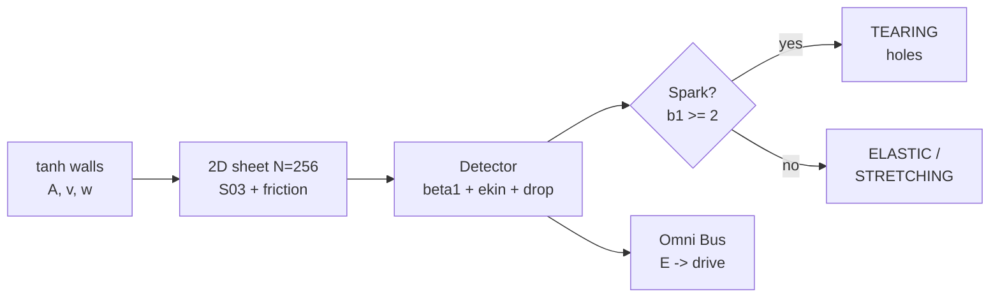

<p align="center"></p>

<h1 align="center">GCR — Great Ratiss Collider</h1>
<p align="center"><i>Collision of 2 tanh walls in a self-gravitating sheet — the <b>topological sparks</b>, measured.</i></p>
<p align="center"><b>Virtual universe only</b> — NO NEURONS, 100% fabric. ⚡</p>

<p align="center">


</p>

<p align="center"></p>

> *"The fabric does not just vibrate: at B'≳500, it punctures — and then never closes again."*
> — the chief. (V1 exploded in flight. We invalidated it, not patched it. 😇)

---

## ⚡ In 30 seconds

| ⚡ | Discovery | Measured verdict (V3 battery, 11 runs) |
|---|---|---|
| 1 | Topological spark | holes **b1=2-4**, life 0.2-0.8tu, if γ=0.05, A≥10, v≥3 |
| 2 | Tearing vs stretching | low γ: holes · high γ: drop 0.23, **never** a hole |
| 3 | Elastic threshold | A=3: b1=0, the fabric **survives** |
| 4 | Irreversible fragmentation | r_rms 2→13, open, no re-annealing |
| 5 | V1 invalidated | numerical explosion → refuted; V3: **0 clips** |

**Status: V3 STABLE, 4/4 TESTS.** Details: [DECOUVERTES.md](DECOUVERTES.md).

---

## 🗺️ Table of contents

1. [The concept](#concept) — 2. [Quick start](#quickstart) — 3. [The lab's rooms](#salles) — 4. [The battery](#batterie) — 5. [Key numbers](#chiffres) — 6. [Examples](#exemples) — 7. [The method](#methode) — 8. [Architecture](#archi) — 9. [Roadmap](#roadmap) — 10. [Tree](#arbo) — 11. [Credits](#credits)

---

<a id="concept"></a>
## 1. 💡 The concept

**The observation**: what happens when two energy walls hit a sheet of self-gravitating matter whose fabric has a **Planck stiffness** (S03 micro-law: F=-g/r²+k/r⁴, k=0.108)? Here: N=256 2D particles, kinematic Gaussian walls, exact β1 detector (Euler characteristic on an alpha complex). We measure the **brutality** B'=v·A/(w·γ) and we watch whether the fabric vibrates, stretches — or **tears into topological holes**.

**Toy units**: capacity to deform, NOT GeV. The QPU (hardware tester) lives in synchrotron-24/qpu-bigbang — GCR = pure virtual.

---

<a id="quickstart"></a>
## 2. 🚀 Quick start

```bash
git clone https://github.com/jonathansearch/GCR.git
cd GCR
pip install -e .
pytest tests/ -q                    # 4/4 (control, spark, stretch, Omni)
python3 univers/batterie_gcr.py     # 11 runs, 69 s -> resultats/gcr_v1.json
```

---

<a id="salles"></a>
## 3. 🏛️ The lab's rooms

| Room | Folder | Content |
|---|---|---|
| ⚡ Collider | `univers/` | collision.py (engine) + batterie_gcr.py (11 runs) |
| 📦 Raw facts | `resultats/` | gcr_v1.json (the numbers) |
| 🎫 Question | `tickets/` | ETINCELLE_TOPOLOGIQUE.md |
| 📜 Journal | `JOURNAL.md` | the full log |
| ⚡ Findings | `DECOUVERTES.md` | the 6 sealed discoveries |
| 🖼️ Gallery | `figures/` + `images/` | 3 figures + logo + fresco |

---

<a id="batterie"></a>
## 4. 🧪 The V3 battery (11 runs, 0 clips)

| v | A | γ | b1max | drop | E_max/E_eq | verdict |
|---|---|---|---|---|---|---|
| 2-5 | 3 | 0.3 | 0 | 0.04 | ~1.0 | elastic 🎈 |
| 2-5 | 10 | 0.3 | 0-1 | ≤0.23 | ≤7.8 | stretching (never a hole!) |
| 3 | 10 | **0.05** | **4** | 0.23 | 3.6 | **SPARK** ⚡ |
| 5 | 10 | **0.05** | **2** | 0.32 | 4.8 | **SPARK** ⚡ |
| 5 | 20 | **0.05** | **3** | 0.31 | 10.0 | **SPARK** ⚡ |

Control (A=0): b1max=0. Threshold: B'≳500 + low γ. Healthy vmax everywhere.


---

<a id="chiffres"></a>
## 5. 📊 Key numbers

| Measurement | Value | Control |
|---|---|---|
| Sparks | b1 = 2, 3, 4 (3 runs) | A=0: b1=0 |
| Threshold | γ=0.05, A≥10, v≥3 (B'≳500) | γ=0.3: 0 hole even at E×7.8 |
| Max drop (stretching) | 0.23 | — |
| Stability | 0 clips, vmax ≤ 9.6 | V1: e_kin~1e6 (invalidated) |
| Fate | r_rms 2→13, irreversible | — |

---

<a id="exemples"></a>
## 6. 💻 Examples

**Ex. 1 — A shot that sparks:**
```python
import sys; sys.path.insert(0, 'univers')
from collision import run, etincelle
s, eq, _ = run(5.0, 0.5, A=10.0, gamma=0.05)
print(etincelle(s))   # b1_max=2.0, etincelle=True
```

**Ex. 2 — GCR drives Omni (ecosystem update):**
```python
from ratiss_core.bus import OmniBus
from ratiss_core.control import control_step
bus = OmniBus('/tmp/gcr_bus.dat', create=True)
bus.write(E_turb=max(p['ekin'] for p in s), T2_us=223.7, Q_fus=2.0)
print(control_step(bus))   # drive adjusted from the collision
```

---

<a id="methode"></a>
## 7. ⚖️ The method

**Equilibrate before shooting** (600 steps without walls — V2 did not do it). **Anti-explosion soft-core** + clip counter (0 required). **Invalidate, not patch** (V1). Every run has its control. The NUMBERS are toy; the REGIMES (tearing/stretching, threshold, irreversibility) are the physics.

---

<a id="archi"></a>
## 8. 🗺️ Architecture



---

<a id="roadmap"></a>
## 9. 🗺️ Roadmap

1. 🧲 **N=1024**: do the sparks grow?
2. ⚛️ **QPU**: plug in the hardware tester (synchrotron-24/qpu-bigbang)
3. 📰 **Publication**: the spark paper (chief alone decides)

---

<a id="arbo"></a>
## 10. 📁 Tree

```
GCR/
├── README.md            # ← you are here
├── DECOUVERTES.md       # the 6 discoveries
├── LISEZMOI.md          # technical summary
├── JOURNAL.md           # full log
├── LICENSE              # MIT
├── pyproject.toml
├── univers/             # collision.py + batterie_gcr.py
├── resultats/           # gcr_v1.json
├── tickets/             # ETINCELLE_TOPOLOGIQUE
├── figures/             # 3 figures
├── tests/               # 4 sealed
└── images/              # logo + fresco + lab
```

---

<a id="credits"></a>
## 11. 🖖 Credits

Designed and measured by **RATISS LABS**, Douala 🇨🇲 — free, reproducible, no neurons.

<p align="center"></p>

## 📜 License

MIT — see [LICENSE](LICENSE). Copyright (c) 2026 Jonathan.


## 🔗 Cross-repository dependencies

This repository uses: **RATISS-Omni**. Clone them **side by side** in the same parent folder
(`git clone https://github.com/jonathansearch/<REPO>.git`), or point `RATISS_HOME` to that parent folder:

```bash
export RATISS_HOME=/path/to/the/folder/of/the/repos
pytest tests/ -q
```

No absolute path is hardcoded (portability fix of 09/30/2026).
